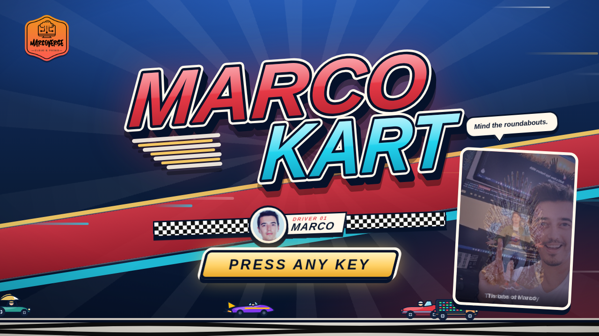
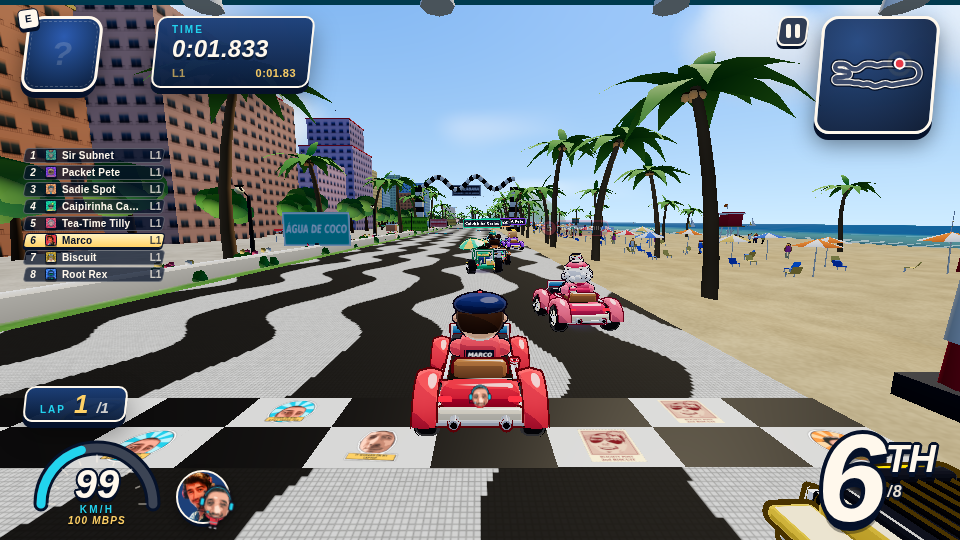
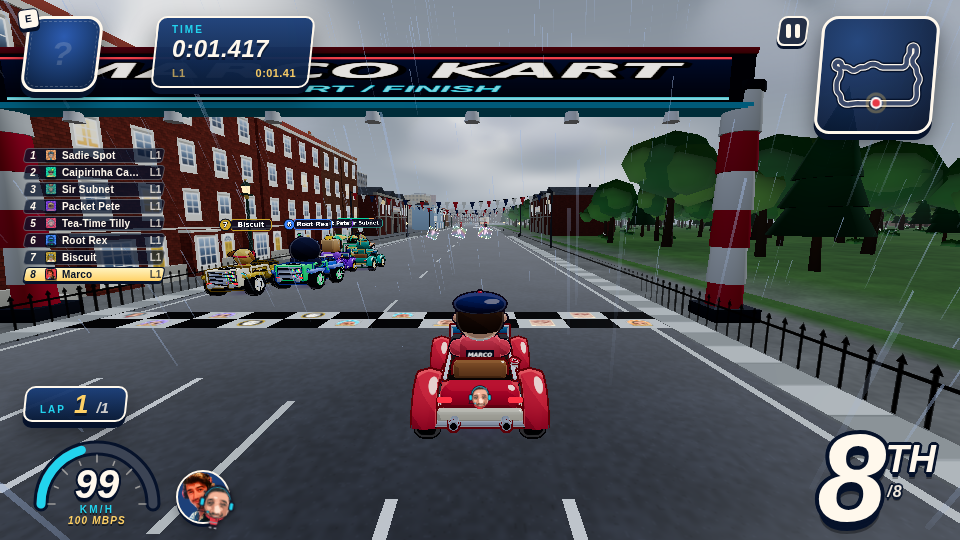
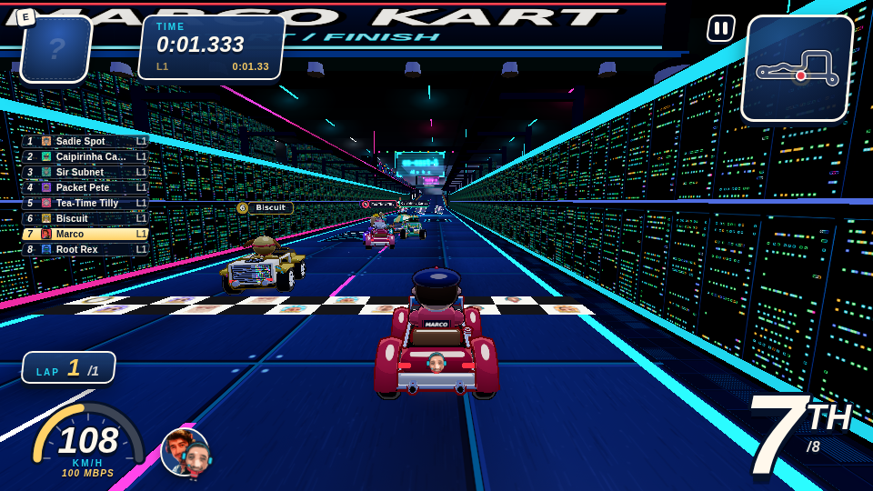
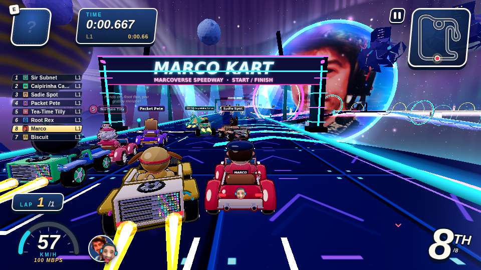
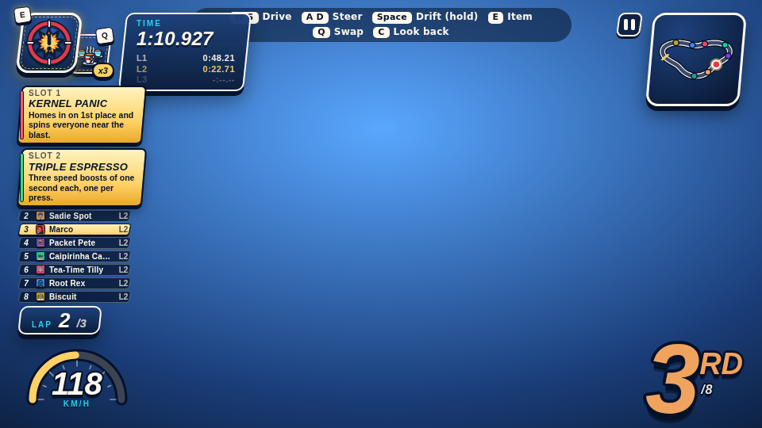

# Marco Kart

A kart racer in the browser, in the spirit of the classics, but every corner of it is about **Marco**: a British cloud and networking instructor living in Copacabana, Rio de Janeiro, who runs the [Marcoverse](https://marcoverse.co.uk) brand.

Built with **Three.js**, shipped as **one self-contained HTML file** (no server, no network at runtime). Original IP only: no borrowed characters, names, art or sound.



## Play it

**Live:** https://pinnersinner.github.io/marco-kart/ (once Pages is enabled, see [Deploying](#deploying)).

Or run it locally:

```bash
npm ci
node tools/build.mjs        # writes dist/marco-kart.html
# open dist/marco-kart.html in any modern browser
```

### Controls

| Action | Keyboard | Gamepad | Touch |
|---|---|---|---|
| Accelerate | W / Up | RT or A | automatic |
| Brake / reverse | S / Down | LT or B | BRAKE button |
| Steer | A / D or Left / Right | Left stick or D-pad | steer pad |
| Drift (hold while steering, release to boost) | Space or Shift | RB | DRIFT button |
| Use item | E, Enter or Z | see in-game controls page | tap the item box |
| Swap the two held items | Q or Tab | LB | tap the small slot |
| Look back | C or B | Y | LOOK button |
| Pause | Esc or P | Start | pause button |

## What's in it

- **Four tracks**, each around 2.8 km a lap, each with real forks, shortcuts and rampable traffic.
  - **Copacabana**: black-and-white wave pavement, beach side, the Marco-Cabana arch.
  - **Blighty**: London streets, buses you can jump off.
  - **Datacentre**: neon racks and cabling.
  - **Marcoverse Speedway**: a space-age finale with Marco's face in the sky.
- **Eight racers** with their own karts, handling profiles, voices and personalities: Marco, Sir Subnet, Packet Pete, Caipirinha Carlos (entirely Brazilian Portuguese), Tea-Time Tilly, Root Rex, Lambda Lucy and Biscuit the dog.
- **Speed classes** (50 / 100 / 150 / 200 Mbps), the equivalent of engine classes.
- **Drifting with three boost levels**, plus a perfect-takeoff boost when you jump a ramp at the right moment.
- **24 items**: 20 for everyone plus 4 only Biscuit gets. You can hold two at once. Weighted by race position, so leaders get defence and the back of the pack gets comebacks. Every item has a unique sound and an in-game Item Guide.
- **Dialogue everywhere**: hundreds of lines per character, overlapping voices (browser speech plus procedural blip voices), throwaway chatter like "Weeeee!" from rivals, and floating text that never blocks the road.
- **Marco's own assets**: his photos, caricature art and recorded voice lines are baked in. Everything also works with zero user assets.

| | |
|---|---|
|  |  |
| Copacabana | Blighty |
|  |  |
| Datacentre | Marcoverse Speedway |



## How it's built

| Area | Where |
|---|---|
| Spec and ownership rules | [`SPEC.md`](SPEC.md) |
| Cross-agent notes and decisions | [`REQUESTS.md`](REQUESTS.md) |
| Voice lines still to record | [`VOICELINES.md`](VOICELINES.md) |
| Core config, items, input, assets | `src/core/` |
| Track engine and the four tracks | `src/track/` |
| Kart physics, camera, speed classes | `src/kart/` |
| Race logic, AI, items | `src/race/` |
| Rendering and scenery | `src/visuals/` |
| Audio mix, blips, speech | `src/audio/` |
| Dialogue director and bark banks | `src/dialogue/` |
| Menus and HUD | `src/ui/` |
| Build and asset pipeline | `tools/` |
| Tests (about 590) | `test/` |

Technical notes:

- Fixed 60 Hz timestep with render interpolation. Simulation code never reads the clock.
- Everything outside `src/ui`, `src/audio` and `src/core/input.js` imports cleanly in plain Node, so the whole race (physics, AI, items) is unit tested and simulated headlessly.
- `tools/build.mjs` bundles with esbuild and embeds `assets/user/*` as data URIs, producing one HTML file of about 12 MB.
- The audio mix keeps music constant and puts voices about 5 dB above it. `node tools/mix_check.mjs` enforces that.
- Assets live in `assets/user/`, keyed by filename without extension. `tools/photos_build.py` and `tools/caricature_build.py` produce the photo and caricature art with image processing (OpenCV, Pillow), not generative AI.

```bash
npm test                                         # full suite
node test/race_sim_report.mjs --track copacabana # AI race sim per track
node tools/play.mjs shots/run --track blighty    # headless playthrough + screenshots
```

## Deploying

Pushing to `main` runs [`.github/workflows/deploy.yml`](.github/workflows/deploy.yml): install, test, build, publish to GitHub Pages.

One-off setup: **Settings → Pages → Build and deployment → Source: GitHub Actions**.

### Custom domain

1. Add a `CNAME` file at the repo root containing your hostname, e.g. `kart.marcoverse.co.uk`.
2. At your DNS provider add a `CNAME` record: `kart` → `pinnersinner.github.io`.
3. In **Settings → Pages**, enter the domain and tick **Enforce HTTPS** once the certificate is issued.

## Licence and assets

Code: all rights reserved by the author unless a licence file says otherwise. Photos, caricatures and voice recordings are Marco's own and are included with his permission. Please don't reuse them.
